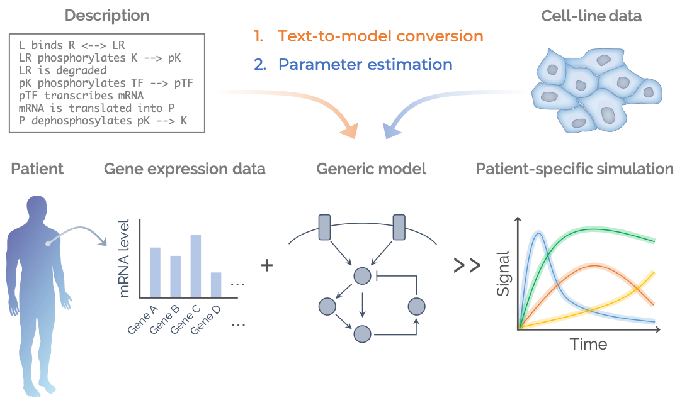
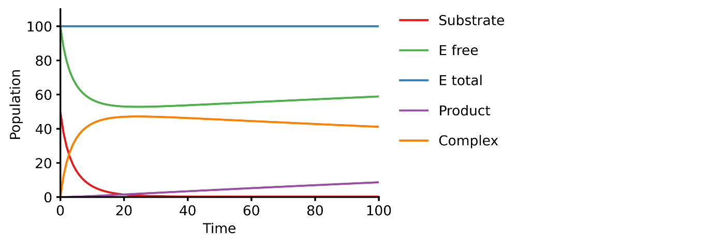

[](https://github.com/pasmopy/pasmopy/actions)
[](https://opensource.org/licenses/Apache-2.0)
[](https://github.com/psf/black)

# Pasmopy – Patient-Specific Modeling in Python



<!--

-->

**Pasmopy** is a scalable toolkit for classifying cancer subtypes based on intracellular signaling dynamics generated from kinetic modeling. It is compatible with [biomass](https://github.com/biomass-dev/biomass) and offers the following features:

- Construction of mechanistic models from text
- Personalized predictions of patient outcomes
- Analysis of patient-specific pathway activities
- Cancer subtype classification based on dynamic response characteristics

## Installation

The latest stable release (and required dependencies) can be installed from PyPI:

```bash
$ pip install pasmopy
```

Pasmopy requires Python 3.7+ to run.

## Example

### Model development

This example shows you how to build a simple Michaelis-Menten two-step enzyme catalysis model with Pasmopy.

> E + S ⇄ ES → E + P

An enzyme, E, binding to a substrate, S, to form a complex, ES, which in turn releases a product, P, regenerating the original enzyme.

1. Prepare a text file describing biochemical reactions (`michaelis_menten.txt`)

   ```
   E binds S --> ES | kf=0.003, kr=0.001 | E=100, S=50
   ES dissociates to E and P | kf=0.002, kr=0

   @obs Substrate: u[S]
   @obs E_free: u[E]
   @obs E_total: u[E] + u[ES]
   @obs Product: u[P]
   @obs Complex: u[ES]

   @sim tspan: [0, 100]
   ```

1. Convert text into an executable model

   ```python
   from pasmopy import Text2Model

   Text2Model("michaelis_menten.txt").convert()
   ```

1. Run simulation with [`biomass`](https://github.com/biomass-dev/biomass)

   ```python
   from biomass import Model, run_simulation
   import michaelis_menten

   model = Model(michaelis_menten.__package__).create()
   run_simulation(model)
   ```

   
    <!--
    
    -->

## Author

[Hiroaki Imoto](https://github.com/himoto)

## License

[Apache License 2.0](https://github.com/pasmopy/pasmopy/blob/master/LICENSE)
