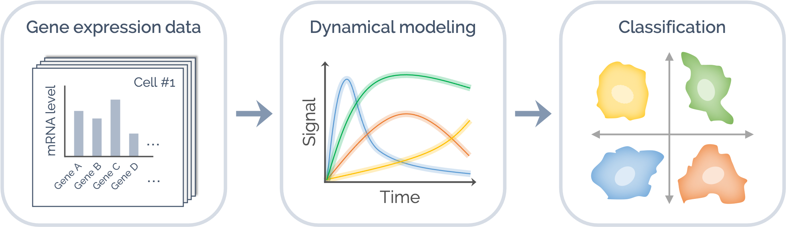

# Dyaus – Dynamics-driven automatic subtyping

[](https://github.com/okadalabipr/dyaus/actions)
[](https://opensource.org/licenses/Apache-2.0)
[](https://github.com/psf/black)

Dyaus is a scalable framework for classifying cancer subtypes based on intracellular signaling dynamics generated from kinetic modeling.



## Features

- Model construction
- Data integration
- Parameter estimation
- Personalized predictions of patient outcomes
- Cancer subtype classification

## Requirements

| Language      | Dependent packages                                 |
| ------------- | -------------------------------------------------- |
| Python >= 3.7 | [biomass](https://github.com/okadalabipr/biomass)  |
| Julia >= 1.5  | [BioMASS.jl](https://github.com/himoto/BioMASS.jl) |
| R             | [TODO] Write dependent packages here.              |

## Workflow for classifying breast cancer subtypes

- Build an executable model of the ErbB signaling network

  ```python
  from biomass import TextToModel

  TextToModel("models/erbb_network.txt").to_biomass()
  ```

- Integrate TCGA and CCLE data

  [TODO] Write analysis procedure here.

- Estimate model parameters from experimental data

  ```bash
  $ cd training
  $ mkdir errout
  $ sh optimize_parallel.sh
  ```

- Run patient-specific models

  ```python
  from dyaus import PatientModelSimulations

  with open ("models/breast/sample_names.txt", mode="r") as f:
      TCGA_ID = f.read().splitlines()

  simulations = PatientModelSimulations("models.breast", TCGA_ID)

  simulations.run()
  ```

- Classify cancer subtypes based on the ErbB signaling dynamics

  [TODO] Write analysis procedure here.

## Installation

```
$ git clone https://github.com/okadalabipr/dyaus.git
```

## Author

- [Hiroaki Imoto](https://github.com/himoto)
- Sawa Yamashiro

## License

[Apache-2.0 License](LICENSE)
