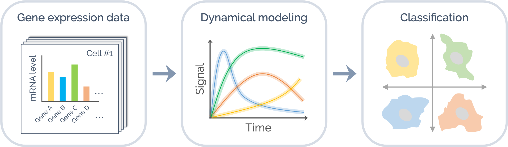

# Dyaus

Dyaus (**Dy**namics-driven **au**tomatic **s**ubtyping) is a scalable framework for classifying cancer subtypes based on intracellular signaling dynamics generated from dynamical modeling.



## Workflow

- Build an executable model of the ErbB signaling network

  ```python
  from biomass import TextToModel

  TextToModel("erbb_network.txt").to_biomass()
  ```

- Integrate TCGA and CCLE data

  [TODO] Write analysis procedure here.

- Estimate model parameters from experimental data

  ```bash
  $ cd training
  $ sh optimize_parallel.sh
  ```

- Run simulation of patient-specific models

  ```python
  from dyaus import PatientSpecificModel

  with open ("TCGA_breast.txt", mode="r") as f:
      TCGA_ID = f.readlines()

  PatientSpecificModel(TCGA_ID).run()
  ```

- Classify cancer subtypes based on the ErbB signaling dynamics

  [TODO] Write analysis procedure here.

## Author

- [Hiroaki Imoto](https://github.com/himoto)
- Sawa Yamashiro

## License

[Apache license 2.0](LICENSE)
