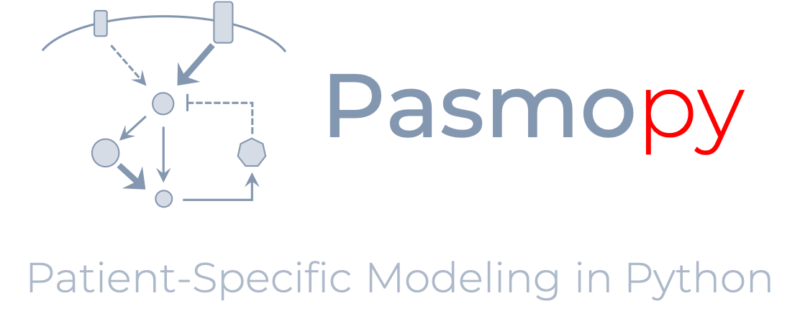

About
=====

What is Pasmopy?
----------------

Pasmopy is a scalable toolkit to identify prognostic factors for cancers based on intracellular signaling dynamics generated from personalized kinetic models.
It is compatible with `biomass <https://github.com/biomass-dev/biomass>`_ and offers the following features:

* Construction of mechanistic models from text
* Personalization of the model using transcriptome data
* Prediction of patient outcome based on *in silico* signaling dynamics
* Sensitivity analysis for prediction of potential drug targets

License
-------

The software is released under the `Apache License 2.0 <https://opensource.org/licenses/Apache-2.0>`_.
For details, see the `LICENSE <https://github.com/pasmopy/pasmopy/blob/master/LICENSE>`_ file in the pasmopy repository.

Author
------

`Hiroaki Imoto <https://github.com/himoto>`_

Citation
--------

If you use Pasmopy in a scientific publication, please cite the following papers:

* Imoto, H., Yamashiro, S. & Okada, M. A text-based computational framework for patient -specific modeling for classification of cancers. *iScience* **25**, 103944 (2022). https://doi.org/10.1016/j.isci.2022.103944

    .. code-block:: bibtex
      
        @article{imoto2022text,
          title = {A text-based computational framework for patient-specific modeling for classification of cancers},
          author = {Imoto, Hiroaki and Yamashiro, Sawa and Okada, Mariko},
          journal = {iScience},
          volume = {25},
          number = {3},
          pages = {103944},
          year = {2022},
          doi = {10.1016/j.isci.2022.103944},
        }

* Imoto, H., Yamashiro, S., Murakami, K. & Okada, M. Protocol for stratification of triple-negative breast cancer patients using *in silico* signaling dynamics. *STAR Protocols* **3**, 101619 (2022). https://doi.org/10.1016/j.xpro.2022.101619

    .. code-block:: bibtex
    
        @article{imoto2022protocol,
          title = {Protocol for stratification of triple-negative breast cancer patients using in silico signaling dynamics},
          author = {Imoto, Hiroaki and Yamashiro, Sawa and Murakami, Ken and Okada, Mariko},
          journal = {STAR protocols},
          volume = {3},
          number = {3},
          pages = {101619},
          year = {2022},
          doi = {10.1016/j.xpro.2022.101619},
        }

When presenting work that uses Pasmopy, feel free to use `Pasmopy logo <https://github.com/pasmopy/pasmopy/blob/master/docs/_static/img/pasmopy-project-logo.png>`_.

Contact
-------

If you discovered an error or need help, please contact me via `GitHub Issues <https://github.com/pasmopy/pasmopy/issues>`_.
Please head over to `GitHub Discussions <https://github.com/pasmopy/pasmopy/discussions>`_ if you have any questions or would like to start a new discussion.
In either case, you can also always send me an `email <mailto:himoto@protein.osaka-u.ac.jp>`_.

Any contributions to Pasmopy are more than welcome!