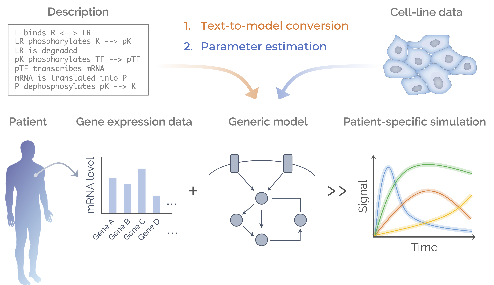

=============================================
Pasmopy – Patient-Specific Modeling in Python
=============================================

|PyPI version| |Actions Status| |Documentation Status| |License| |Downloads| |Python versions| |Code quality| |Pre commit| |Code style| |Imports| |iScience paper|

Pasmopy is an open-source Python package for the development of signaling pathway models that are individualized to patient-specific data.
It includes modules for model construction, parameterization, *in silico* patient stratification, and more.

**Source code:** https://github.com/pasmopy/pasmopy

The open access publication describing Pasmopy is available here:

* Imoto, H., Yamashiro, S. & Okada, M. A text-based computational framework for patient -specific modeling for classification of cancers. *iScience* (2022). https://doi.org/10.1016/j.isci.2022.103944

.. toctree::
   :maxdepth: 2
   :caption: Contents:
   :hidden:

   about
   installation
   model_development
   personalized_model
   modules/index

.. |PyPI version| image:: https://img.shields.io/pypi/v/pasmopy.svg?logo=PyPI&logoColor=white
   :target: https://pypi.python.org/pypi/pasmopy/
   :alt: PyPI version

.. |Actions Status| image:: https://github.com/pasmopy/pasmopy/workflows/Tests/badge.svg
   :target: https://github.com/pasmopy/pasmopy/actions
   :alt: Actions Status

.. |Documentation Status| image:: https://img.shields.io/readthedocs/pasmopy/latest.svg?logo=read%20the%20docs&logoColor=white&&label=Docs&version=latest
   :target: https://pasmopy.readthedocs.io/en/latest/?badge=latest
   :alt: Documentation Status

.. |License| image:: https://img.shields.io/badge/License-Apache%202.0-green.svg
   :target: https://opensource.org/licenses/Apache-2.0
   :alt: License

.. |Downloads| image:: https://pepy.tech/badge/pasmopy
   :target: https://pepy.tech/project/pasmopy
   :alt: Downloads

.. |Python versions| image:: https://img.shields.io/pypi/pyversions/pasmopy.svg?logo=Python&logoColor=white
   :target: https://pypi.python.org/pypi/pasmopy/
   :alt: Python versions

.. |Code quality| image:: https://img.shields.io/lgtm/grade/python/g/pasmopy/pasmopy.svg?logo=lgtm&logoWidth=18
   :target: https://lgtm.com/projects/g/pasmopy/pasmopy/context:python
   :alt: Code quality: Python

.. |Pre commit| image:: https://results.pre-commit.ci/badge/github/pasmopy/pasmopy/master.svg
   :target: https://results.pre-commit.ci/latest/github/pasmopy/pasmopy/master
   :alt: pre-commit.ci status

.. |Code style| image:: https://img.shields.io/badge/code%20style-black-000000.svg
   :target: https://github.com/psf/black
   :alt: Code style: black

.. |Imports| image:: https://img.shields.io/badge/%20imports-isort-%231674b1?style=flat&labelColor=ef8336
   :target: https://pycqa.github.io/isort/
   :alt: Imports: isort

.. |iScience paper| image:: https://img.shields.io/badge/DOI-10.1016%2Fj.isci.2022.103944-blue
   :target: https://doi.org/10.1016/j.isci.2022.103944
   :alt: iScience paper